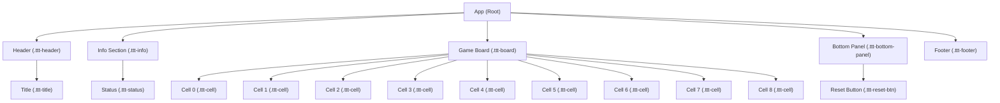

# tic_tac_toe_frontend – Architecture Documentation

## Overview

The `tic_tac_toe_frontend` is a lightweight, modern React web application that implements an interactive, two-player local Tic-Tac-Toe game. It is designed for clarity, minimalism, and responsive usability, utilizing only vanilla CSS (no heavy UI libraries) and concise React component logic.

## Component Hierarchy

All application logic and UI are housed within a single top-level React component: `App`. This emphasizes simplicity, as the app is small enough to remain readable and maintainable this way. The entrypoint (`index.js`) renders `App` to the DOM.

### Component Tree

```
index.js
└─ App
   ├─ header (.ttt-header > .ttt-title)
   ├─ div (.ttt-info > .ttt-status)         [Player turn status]
   ├─ div (.ttt-board)
   │     └─ button[9] (.ttt-cell)           [Tic-Tac-Toe grid]
   ├─ div (.ttt-bottom-panel)
   │     └─ button (.ttt-reset-btn)         [Reset Game]
   └─ footer (.ttt-footer)
```

#### Mermaid Diagram (Component Structure & UI Hierarchy)



**Note:** Each ".ttt-cell" is a button forming a 3x3 grid for the board.

## UI Layout and Design

- **Centered Main Container:** The gameplay area and UI elements are vertically and horizontally centered using `.ttt-main-container`.
- **Header:** Displays the title, styled with brand theming (`Tic Tac Toe` with accent colors).
- **Status Area:** Shows current player, win or draw status, updated after each move.
- **Game Board:** The Tic-Tac-Toe grid is a 3x3 CSS Grid (`.ttt-board`), responsive for desktop and mobile.
- **Bottom Panel:** Includes a single button to reset the game.
- **Footer:** Minimal footer with a React/"Two-player local" attribution.

## Main Game Logic

- **State Management**
    - `board`: Single React state array of 9 elements (`'', 'X', 'O'`) holds board data.
    - `isXNext`: Boolean for the current player (`true` for 'X', `false` for 'O').
    - Both are managed with React's `useState` hooks.

- **Game Actions**
    - **Cell Click:** When a cell is clicked, `handleClick(idx)` updates the board if the cell is empty and there's no winner, sets the player's mark, updates state, and toggles turns.
    - **Win Detection:** After each move, `calculateWinner(board)` checks for any winning combination. If none and the board is full, the game is a draw.
    - **Reset:** `resetGame()` restores board and current player to initial state.
    - **Status Update:** Status message reflects the current player, win, or draw, and is dynamically rendered above the board.

## State Flow

1. **Initial Render:** Empty board, 'X' to play.
2. **Player Move:** On cell click, mark cell, switch turn, and status updates.
3. **Victory/Draw:** If a player wins or the board is full, update status and disable input.
4. **Reset:** User can start a new game at any time.

## Styling and Theming

- **Themes and Variables:** Brand and UI colors are set as CSS variables in `App.css`, allowing easy customization and light theme consistency.
    - `--primary` (main blue), `--secondary` (gray), `--accent` (yellow for highlight), backgrounds, text, and border colors.
- **Modern Minimalist Look:** Visuals emphasize clarity and readability, with gentle shadows, rounded borders, and accessible color contrasts.
- **Responsiveness:** Mobile-friendly adjustments using CSS media queries, e.g., smaller board cells on narrower screens.
- **Component Classes:** Each major app region and game element (board, cell, button, etc.) has a distinct class such as `.ttt-board`, `.ttt-cell`, `.ttt-reset-btn`.

## Key Files

- `src/App.js` – Main React logic, state management, UI, handlers.
- `src/App.css` – Theme, layout, and component styles.
- `src/index.js` – Entry point, renders `App` into the DOM.

## Extensibility

Though the app currently supports only local two-player gameplay, the architecture could be extended to support features like online play, score tracking, or additional game settings by following this pattern:
- Extracting board/cell logic into reusable components for modularity.
- Introducing context or state management libraries if the app's complexity grows.

---

**Summary:**  
This architecture describes a focused, single-component app with minimal dependencies, a clear state model, and modern mobile-friendly styles, designed for both ease of use and maintainability.

